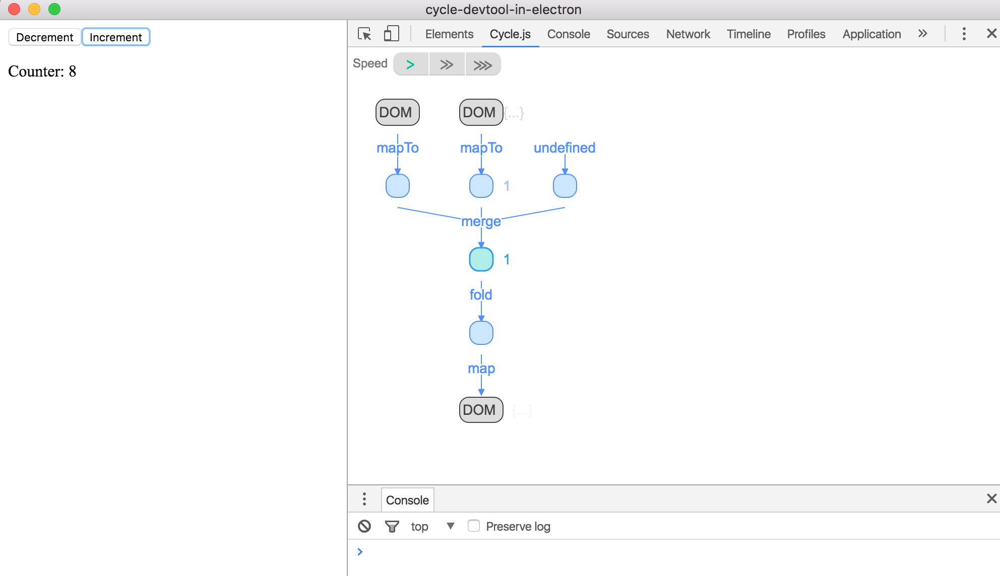

# cycle-devtool-in-electron
> Opens a local file or remote URL in Electron with Cycle DevTool panel

## Directions

* Clone this repo
* Install [Cycle DevTool](https://github.com/cyclejs/cyclejs/tree/master/devtool)
  Chrome Extension in your Chrome
* Start with URL of a page with a Cycle app or with local filename

Should open Electron app and have the Cycle panel that can show the current
page

